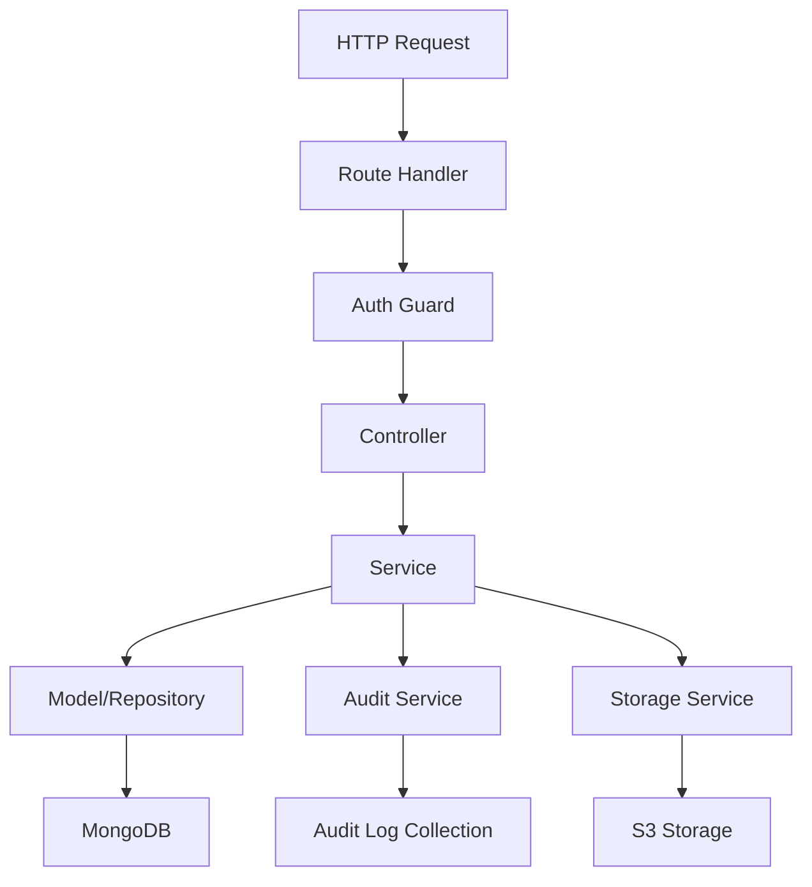

# System Architecture

## Overview
The CNC Recruit 2026 Backend API follows a layered architecture with clear separation of concerns. The system is built around the Elysia.js framework and uses dependency injection to manage component relationships.

## Architectural Layers

### 1. Presentation Layer (Routes)
- **Location**: `src/features/*/*.route.ts`
- **Responsibility**: HTTP request handling, validation, and response formatting
- **Components**: Route handlers that delegate to controllers
- **Security**: Authentication middleware, rate limiting, CORS

### 2. Application Layer (Controllers)
- **Location**: `src/features/*/*.controller.ts`
- **Responsibility**: Orchestrating business logic, input validation, error handling
- **Pattern**: Controller classes that use services
- **Dependencies**: Injected services, audit logging

### 3. Domain Layer (Services)
- **Location**: `src/features/*/*.service.ts`
- **Responsibility**: Business logic implementation, data transformation
- **Pattern**: Service classes with single responsibilities
- **Dependencies**: Data access, other services, audit logging

### 4. Data Access Layer (Models)
- **Location**: `src/features/*/*.model.ts`
- **Responsibility**: Data schema definition, database operations
- **Pattern**: MongoDB collections with TypeScript types
- **Validation**: Runtime validation with TypeBox schemas

### 5. Infrastructure Layer (Core)
- **Location**: `src/core/`
- **Responsibility**: Cross-cutting concerns, utilities, configuration
- **Components**: Database connection, file storage, logging, error handling

## Component Relationships



## Dependency Injection Graph

The system uses manual dependency injection managed in `src/lib/controllers.ts`:

```typescript
// Example dependency chain
AuditLogService → AuthService → AuthController
                    ↓
FormService → FormController
                    ↓
CandidateService → CandidateController
                    ↓
InterviewSlotService → InterviewSlotController
```

## Core Components

### 1. Application Bootstrap (`src/core/bootstrap.ts`)
- **Purpose**: System initialization
- **Responsibilities**:
  - Ensure S3 bucket exists with proper policies
  - Create default admin users
  - Initialize form configuration
- **Execution**: Runs on application startup

### 2. Configuration Management (`src/core/config.ts`)
- **Purpose**: Centralized configuration
- **Environment Variables**:
  - `NEXTAUTH_SECRET`: JWT secret key
  - `MONGO_URI`: MongoDB connection string
  - `MONGO_DB_NAME`: Database name
  - `S3_*`: Storage configuration
  - `ELYSIA_PORT`: Server port (default: 4000)

### 3. Database Connection (`src/core/db.ts`)
- **Pattern**: Singleton connection pool
- **Features**:
  - Lazy initialization
  - Connection pooling
  - Error handling and reconnection
- **Collections**: Accessed via async functions that ensure connection

### 4. Error Handling (`src/core/errors.ts`)
- **Custom Errors**: `DomainError` base class
- **HTTP Status Mapping**: Automatic status code assignment
- **Error Format**: Consistent error response format
- **Logging**: Automatic error logging

### 5. Audit Logging System
- **Location**: `src/features/auditLog/`
- **Actions Tracked**: 19 different system actions
- **Change Tracking**: Before/after state for modifications
- **Metadata**: Actor, IP address, timestamp
- **Target Types**: 6 different entity types

## Data Flow Patterns

### 1. Candidate Application Flow
```
Candidate Submission → File Upload → Data Validation → 
Database Storage → Audit Log → Email Notification
```

### 2. Form Configuration Flow
```
Admin Request → Schedule Validation → Database Update → 
Audit Log → Real-time Configuration Update
```

### 3. Interview Scheduling Flow
```
Slot Creation → Capacity Validation → Candidate Assignment → 
Status Updates → Audit Logging
```

## Security Architecture

### 1. Authentication
- **Provider**: Google OAuth
- **Session**: JWT tokens
- **Middleware**: `authGuard` for protected routes
- **Role Checking**: `requireRole` for admin endpoints

### 2. Authorization
- **Roles**: `Admin` and `User`
- **Default Admins**: Pre-configured email addresses
- **Ban System**: User restriction capabilities

### 3. Request Security
- **Rate Limiting**: 100 requests per minute
- **CORS**: Configurable origins and methods
- **Helmet.js**: Security headers
- **IP Tracking**: Request IP logging

### 4. File Security
- **S3 Policies**: Public read for profile images only
- **Private Storage**: Transcripts and other sensitive files
- **Validation**: File type and size validation

## Storage Architecture

### 1. Database Schema
- **Collections**: 7 main collections
- **Relationships**: Reference-based (not embedded)
- **Indexing**: Automatic `_id` indexing
- **Validation**: Application-level (not database-level)

### 2. File Storage
- **Provider**: S3-compatible (MinIO)
- **Bucket Structure**:
  - `cnc-profile/`: Public profile images
  - Other prefixes: Private files
- **Key Naming**: UUID-based with prefixes

### 3. Audit Storage
- **Collection**: `audit_logs`
- **Indexing**: By timestamp, actor, action
- **Retention**: No automatic deletion
- **Query Patterns**: Time-based, action-based, actor-based

## Performance Considerations

### 1. Database Optimization
- Connection pooling
- Appropriate indexing
- Projection for partial data retrieval

### 2. File Handling
- Stream-based uploads/downloads
- Presigned URLs for direct S3 access
- Async processing for large files

### 3. Caching Strategy
- No built-in caching (stateless design)
- Relies on database and S3 performance
- Consider CDN for public profile images

## Scalability Design

### 1. Horizontal Scaling
- Stateless application servers
- Shared MongoDB database
- Shared S3 storage
- Load balancer friendly

### 2. Database Scaling
- MongoDB replica sets
- Read/write separation potential
- Sharding capability

### 3. Storage Scaling
- S3-compatible storage scalability
- CDN integration for public content
- Lifecycle policies for old files

## Monitoring and Observability

### 1. Logging
- Structured logging with levels
- Request/response logging
- Error tracking
- Audit trail

### 2. Health Checks
- `/health` endpoint
- Database connectivity check
- Storage connectivity check

### 3. Metrics
- Request counts (via rate limiting)
- Error rates (via logging)
- Performance metrics (future enhancement)

## Deployment Architecture

### 1. Development Environment
- Local MongoDB with replica set
- Local MinIO instance
- Hot reload with Bun
- Docker Compose for dependencies

### 2. Production Environment
- Docker containerization
- Environment-based configuration
- Health checks
- Log aggregation

## Future Architecture Considerations

### 1. Potential Enhancements
- Redis caching layer
- Message queue for async tasks
- CDN integration
- Advanced monitoring

### 2. Microservices Potential
- Separate services for:
  - File processing
  - Email notifications
  - Analytics
  - Interview scheduling

### 3. API Gateway
- Rate limiting enhancement
- Authentication centralization
- Request transformation
- Circuit breaking