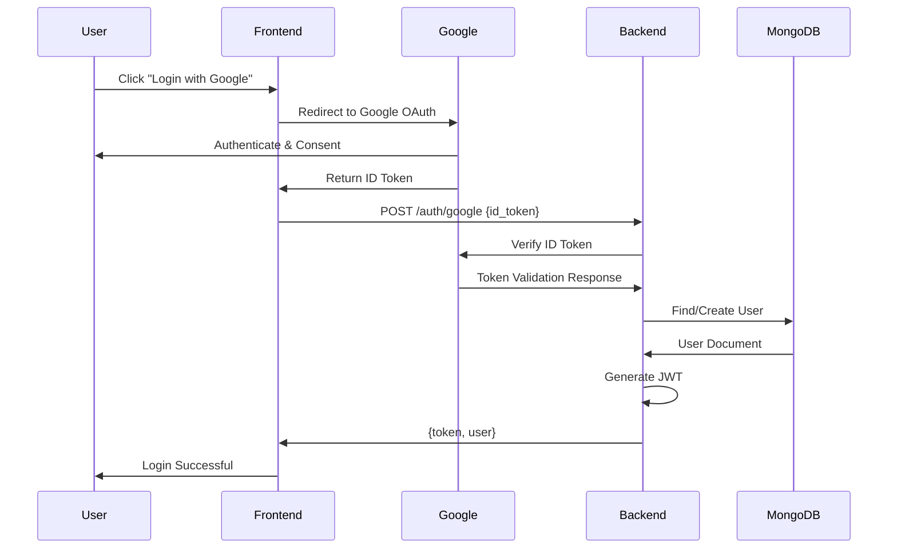

# Authentication and Authorization System

## Overview
The CNC Recruit 2026 Backend API uses Google OAuth for authentication with JWT-based session management. The system implements role-based access control (RBAC) with two primary roles: `Admin` and `User`.

## Authentication Flow

### 1. Google OAuth Login
```
Frontend → Google OAuth → Backend → JWT Token → Frontend
```

### 2. Sequence Diagram


## Components

### 1. Auth Guard (`src/features/auth/auth.guard.ts`)
**Purpose**: Middleware to protect routes requiring authentication

**Features**:
- JWT token validation
- User role checking
- Automatic user creation for new Google accounts
- Ban status checking

**Implementation**:
```typescript
export const authGuard = new Elysia()
  .derive(async ({ headers, ip }) => {
    const token = headers.authorization?.replace("Bearer ", "");
    if (!token) throw new Error("Missing token");
    
    // Verify JWT and get user email
    const email = await verifyToken(token);
    
    // Find or create user
    const user = await authController.ensureUserByEmail(email);
    
    // Check ban status
    if (user.ban) throw new Error("User is banned");
    
    return { user, ip };
  });
```

### 2. Role Requirement (`requireRole`)
**Purpose**: Additional middleware for admin-only endpoints

**Implementation**:
```typescript
export const requireRole = (role: Role) => 
  (handler: Handler) => 
    async (context: Context) => {
      if (context.user.role !== role) {
        throw new Error("Insufficient permissions");
      }
      return handler(context);
    };
```

## User Management

### User Roles

#### 1. Admin (`"Admin"`)
**Permissions**:
- Access all admin endpoints
- Manage candidates, interview slots, form configuration
- Promote/demote users
- Ban/unban users
- View audit logs

**Default Admins**: System automatically creates admins for:
- `thanut.tha@ku.th`
- `worrapon.k@ku.th`
- `wachirawich.s@ku.th`
- `athiruj.k@ku.th`

#### 2. User (`"User"`)
**Permissions**:
- Submit candidate application
- View own candidate profile
- Edit own profile (within editable period)
- Withdraw application
- View public form information
- View available interview slots

### User States

#### 1. Active
- Can authenticate and use the system
- Default state for new users

#### 2. Banned (`ban: true`)
- Cannot authenticate
- All requests rejected with 403
- Can be unbanned by admin

## JWT Token Management

### Token Structure
```typescript
{
  // Header
  alg: "HS256",
  typ: "JWT",
  
  // Payload
  email: "user@example.com",
  role: "Admin" | "User",
  iat: 1234567890,  // Issued at
  exp: 1234567890   // Expiration
  
  // Signature
  // HMAC SHA256 of header + payload
}
```

### Token Generation
```typescript
import { SignJWT } from "jose";

const token = await new SignJWT({ email, role })
  .setProtectedHeader({ alg: "HS256" })
  .setIssuedAt()
  .setExpirationTime("24h")
  .sign(new TextEncoder().encode(secret));
```

### Token Verification
```typescript
import { jwtVerify } from "jose";

const { payload } = await jwtVerify(
  token,
  new TextEncoder().encode(secret)
);
const email = payload.email as string;
```

## Environment Configuration

### Required Environment Variables
```bash
# JWT Secret (minimum 32 characters)
NEXTAUTH_SECRET=your-super-secret-jwt-key-here

# Google OAuth (for future enhancements)
GOOGLE_CLIENT_ID=your-client-id
GOOGLE_CLIENT_SECRET=your-client-secret
```

### Security Recommendations
1. **JWT Secret**: Use a strong, random string (min 32 chars)
2. **Token Expiration**: 24 hours (configurable)
3. **HTTPS**: Always use in production
4. **SameSite Cookies**: For web frontend integration

## API Endpoints

### Authentication Endpoints

#### 1. Google OAuth Login
```
POST /auth/google
Content-Type: application/json

{
  "id_token": "google-id-token-here"
}
```

**Response**:
```json
{
  "token": "jwt-token-here",
  "user": {
    "email": "user@example.com",
    "role": "User",
    "ban": false,
    "createdAt": "2024-01-01T00:00:00Z"
  }
}
```

#### 2. Token Refresh (Future)
```
POST /auth/refresh
Authorization: Bearer <old-token>
```

**Response**: New JWT token

### User Management Endpoints (Admin Only)

#### 1. Get All Users
```
GET /admin/users?page=1&limit=10
```

#### 2. Promote User to Admin
```
POST /admin/users/:email/promote
```

#### 3. Demote User to Regular User
```
POST /admin/users/:email/demote
```

#### 4. Ban User
```
POST /admin/users/:email/ban
```

#### 5. Unban User
```
POST /admin/users/:email/unban
```

## Integration with Frontend

### 1. Login Flow
```javascript
// Frontend implementation example
async function loginWithGoogle() {
  // 1. Get Google ID token from Google Sign-In
  const { token } = await googleAuth.signIn();
  
  // 2. Send to backend
  const response = await fetch('/auth/google', {
    method: 'POST',
    headers: { 'Content-Type': 'application/json' },
    body: JSON.stringify({ id_token: token })
  });
  
  // 3. Store JWT token
  const { token: jwtToken, user } = await response.json();
  localStorage.setItem('token', jwtToken);
  localStorage.setItem('user', JSON.stringify(user));
  
  // 4. Use token for subsequent requests
  return user;
}
```

### 2. API Request with Authentication
```javascript
async function makeAuthenticatedRequest(url, options = {}) {
  const token = localStorage.getItem('token');
  
  const response = await fetch(url, {
    ...options,
    headers: {
      ...options.headers,
      'Authorization': `Bearer ${token}`
    }
  });
  
  if (response.status === 401) {
    // Token expired or invalid
    localStorage.removeItem('token');
    window.location.href = '/login';
    throw new Error('Authentication required');
  }
  
  return response;
}
```

### 3. Role Checking in Frontend
```javascript
function hasRole(requiredRole) {
  const user = JSON.parse(localStorage.getItem('user') || '{}');
  return user.role === requiredRole;
}

// Usage
if (hasRole('Admin')) {
  // Show admin features
}
```

## Security Considerations

### 1. Token Security
- **Storage**: Use HttpOnly cookies for web apps (prevents XSS)
- **Transmission**: Always over HTTPS
- **Expiration**: Short-lived tokens with refresh mechanism
- **Validation**: Verify signature and expiration on every request

### 2. Rate Limiting
- Authentication endpoints have stricter rate limits
- Failed attempts trigger temporary locks (future enhancement)
- IP-based tracking for suspicious activity

### 3. Audit Logging
All authentication events are logged:
- Successful logins
- Failed login attempts
- Role changes
- Ban/unban actions

### 4. Passwordless Design
- No passwords stored in database
- Relies on Google's secure authentication
- Eliminates password-related vulnerabilities

## Error Handling

### Authentication Errors

#### 1. Missing Token
```json
{
  "code": "MISSING_TOKEN",
  "message": "Authorization token is required"
}
```
**HTTP Status**: 401

#### 2. Invalid Token
```json
{
  "code": "INVALID_TOKEN",
  "message": "Token is invalid or expired"
}
```
**HTTP Status**: 401

#### 3. Insufficient Permissions
```json
{
  "code": "INSUFFICIENT_PERMISSIONS",
  "message": "User does not have required role"
}
```
**HTTP Status**: 403

#### 4. User Banned
```json
{
  "code": "USER_BANNED",
  "message": "User account is banned"
}
```
**HTTP Status**: 403

### Recovery Flows

#### 1. Token Expired
- Frontend should redirect to login
- Consider implementing refresh tokens

#### 2. User Banned
- Contact admin for appeal
- No automatic unban process

#### 3. Google Account Issues
- User must resolve with Google
- System cannot recover Google authentication failures

## Testing Authentication

### 1. Unit Tests
```typescript
// Example test for auth guard
describe('AuthGuard', () => {
  it('should reject requests without token', async () => {
    const response = await app.handle(
      new Request('http://localhost/protected')
    );
    expect(response.status).toBe(401);
  });
  
  it('should accept requests with valid token', async () => {
    const token = await generateTestToken('user@example.com');
    const response = await app.handle(
      new Request('http://localhost/protected', {
        headers: { Authorization: `Bearer ${token}` }
      })
    );
    expect(response.status).toBe(200);
  });
});
```

### 2. Integration Tests
- Test complete OAuth flow with mock Google
- Test role-based access control
- Test ban functionality

### 3. Manual Testing
```bash
# Get Google ID token (test environment)
# Use: https://developers.google.com/oauthplayground

# Test authentication
curl -X POST http://localhost:3000/auth/google \
  -H "Content-Type: application/json" \
  -d '{"id_token": "test-id-token"}'

# Test protected endpoint
curl http://localhost:3000/candidate/me \
  -H "Authorization: Bearer <jwt-token>"
```

## Future Enhancements

### 1. Multi-factor Authentication
- SMS verification for sensitive operations
- Email confirmation for admin actions
- Time-based one-time passwords (TOTP)

### 2. Advanced Role System
- Fine-grained permissions (e.g., "Interviewer", "Reviewer")
- Permission groups
- Temporary role assignments

### 3. Session Management
- Active session tracking
- Remote session termination
- Session timeout configuration

### 4. OAuth Providers
- Additional providers (Microsoft, GitHub, etc.)
- Account linking
- Provider fallback

### 5. Security Headers
- Content Security Policy (CSP)
- HTTP Strict Transport Security (HSTS)
- X-Frame-Options, X-Content-Type-Options

## Deployment Considerations

### 1. Production Security
- Use environment variables for secrets
- Rotate JWT secrets periodically
- Monitor authentication logs
- Implement WAF (Web Application Firewall)

### 2. Load Balancing
- Share JWT secret across all instances
- Consider centralized session store for refresh tokens
- Ensure consistent user data across instances

### 3. Disaster Recovery
- Backup JWT secret
- Document manual user creation process
- Test authentication without Google OAuth

### 4. Compliance
- Log all authentication events for audit
- Implement data retention policies
- Provide user data export (GDPR compliance)