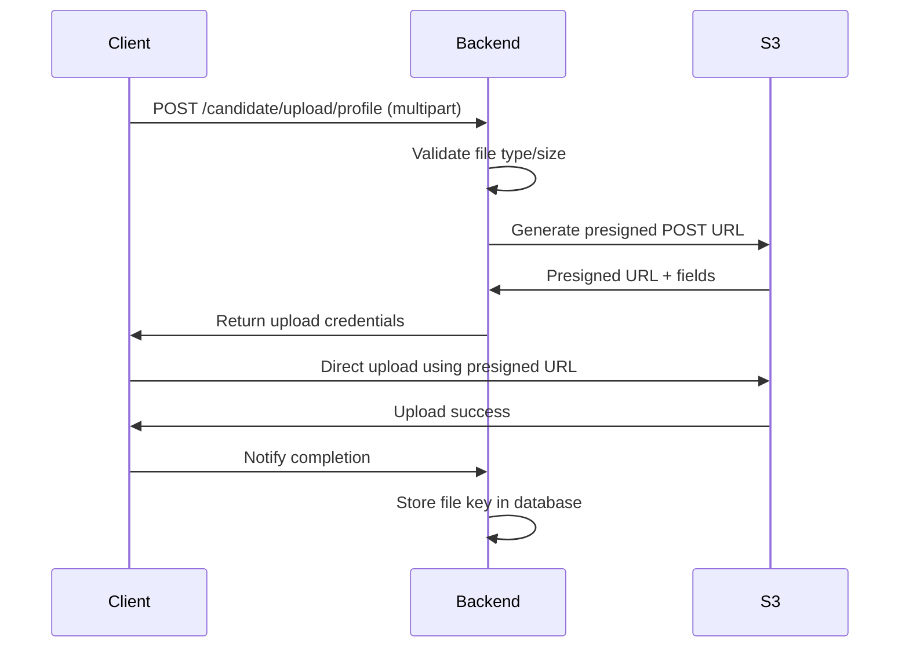

# File Storage System

## Overview
The CNC Recruit 2026 Backend API uses S3-compatible storage (MinIO) for file uploads and management. The system handles profile images, transcripts, and audio recordings with different access policies.

## Architecture

### Storage Components
```
┌─────────────┐    ┌─────────────┐    ┌─────────────┐
│   Client    │───▶│   Backend   │───▶│  S3/MinIO   │
│  (Browser)  │    │   (Elysia)  │    │   Storage   │
└─────────────┘    └─────────────┘    └─────────────┘
       │                  │                  │
       │ Multipart Upload │ Presigned URLs  │ Bucket Policies
       │                  │                  │
       └──────────────────┴──────────────────┘
```

### Key Features
- **S3-compatible**: Works with AWS S3, MinIO, and other S3-compatible services
- **Public/Private Access**: Different policies for different file types
- **Presigned URLs**: Secure temporary access to private files
- **Automatic Bucket Setup**: Bootstrap creates bucket and policies
- **File Validation**: MIME type and size validation

## Configuration

### Environment Variables
```bash
# S3 Configuration
S3_ENDPOINT=http://localhost:9000          # MinIO endpoint
S3_ACCESS_KEY=minioadmin                   # Access key
S3_SECRET_KEY=minioadmin                   # Secret key
S3_BUCKET_NAME=cnc-recruit-2026           # Bucket name
S3_USE_SSL=false                          # SSL enabled (true/false)
```

### S3 Client Configuration (`src/core/storage/storage.client.ts`)
```typescript
export const s3Client = new S3Client({
  endpoint: config.s3.endpoint,
  region: "us-east-1", // Required but can be dummy for MinIO
  credentials: {
    accessKeyId: config.s3.accessKey!,
    secretAccessKey: config.s3.secretKey!,
  },
  forcePathStyle: true, // Required for MinIO
});
```

## File Types and Policies

### 1. Profile Images
- **Location**: `cnc-profile/` prefix
- **Access**: Public read
- **File Types**: Images only (`image/*`)
- **Use Case**: Candidate profile pictures displayed publicly

### 2. Transcripts
- **Location**: Private storage (no specific prefix)
- **Access**: Private (admin only via presigned URLs)
- **File Types**: Images and PDFs (`image/*`, `application/pdf`)
- **Use Case**: Academic transcripts for admin review

### 3. Audio Recordings
- **Location**: Private storage
- **Access**: Private (admin only via presigned URLs)
- **File Types**: Audio files
- **Use Case**: Interview voice memos

## Bucket Policies

### Automatic Policy Setup
On system bootstrap, the following policy is applied:

```json
{
  "Version": "2012-10-17",
  "Statement": [
    {
      "Effect": "Allow",
      "Principal": "*",
      "Action": "s3:GetObject",
      "Resource": "arn:aws:s3:::cnc-recruit-2026/cnc-profile/*"
    }
  ]
}
```

**Purpose**: Makes profile images publicly accessible while keeping other files private.

## File Upload Flow

### 1. Client Upload Process


### 2. Direct S3 Upload (Presigned URLs)
**Advantages**:
- Reduced backend load
- Faster uploads
- Better scalability
- Client-side progress tracking

**Implementation**:
```typescript
// Generate presigned POST URL for client-side upload
const command = new CreateMultipartUploadCommand({
  Bucket: bucketName,
  Key: fileKey,
  ContentType: fileType,
});

const { UploadId } = await s3Client.send(command);
// Return UploadId to client for multipart upload
```

## API Endpoints

### 1. Upload Profile Image
```
POST /candidate/upload/profile
Content-Type: multipart/form-data

Request: profileImage (file)
Response: { "key": "cnc-profile/uuid.jpg", "url": "public-url" }
```

### 2. Upload Transcript
```
POST /candidate/upload/transcript
Content-Type: multipart/form-data

Request: transcript (file)
Response: { "key": "transcripts/uuid.pdf" }
```

### 3. Get Presigned URL (Private Files)
```
GET /storage/url/:key
Authorization: Bearer <token>

Response: { "url": "https://s3...presigned-url...", "expiresIn": 3600 }
```

### 4. Delete File
```
DELETE /storage/:key
Authorization: Bearer <token> (Admin only)

Response: { "deleted": true }
```

## File Key Naming Convention

### Structure
```
{prefix}/{uuid}.{extension}
```

### Prefixes
- `cnc-profile/`: Public profile images
- `transcripts/`: Private transcripts
- `audio/`: Private audio recordings
- `temp/`: Temporary uploads (auto-cleanup needed)

### Example Keys
```
cnc-profile/550e8400-e29b-41d4-a716-446655440000.jpg
transcripts/550e8400-e29b-41d4-a716-446655440001.pdf
audio/550e8400-e29b-41d4-a716-446655440002.mp3
```

## File Validation

### 1. MIME Type Validation
```typescript
// Profile images: image/* only
const profileImageSchema = t.File({ format: "image/*" });

// Transcripts: images or PDFs
const transcriptSchema = t.File({ format: ["image/*", "application/pdf"] });
```

### 2. Size Limits
- **Profile Images**: Recommended max 5MB
- **Transcripts**: Recommended max 10MB
- **Audio**: Recommended max 50MB

*Note: Actual limits depend on S3/MinIO configuration*

### 3. File Name Sanitization
- Remove special characters
- Limit length
- Ensure proper extensions

## Security Considerations

### 1. Access Control
- **Public**: Profile images only (read-only)
- **Private**: All other files (admin access via presigned URLs)
- **Temporary URLs**: Presigned URLs expire (default: 1 hour)

### 2. File Validation
- Server-side MIME type verification
- File size limits
- Malware scanning (future enhancement)

### 3. Data Protection
- Transcripts contain sensitive academic information
- Audio recordings may contain personal conversations
- Implement data retention policies

### 4. CORS Configuration
```typescript
// S3 bucket CORS configuration
const corsConfig = {
  CORSRules: [
    {
      AllowedHeaders: ["*"],
      AllowedMethods: ["GET", "PUT", "POST", "DELETE"],
      AllowedOrigins: ["http://localhost:3000", "https://your-domain.com"],
      ExposeHeaders: ["ETag"],
      MaxAgeSeconds: 3000,
    },
  ],
};
```

## Storage Service Implementation

### 1. Storage Service (`src/core/storage/storage.service.ts`)
**Responsibilities**:
- Generate presigned URLs
- Handle file metadata
- Manage upload sessions
- Delete files

### 2. Storage Controller (`src/core/storage/storage.controller.ts`)
**Responsibilities**:
- API endpoint handling
- Request validation
- Error handling
- Response formatting

### 3. Candidate File Handler (`src/features/candidate/candidate.file.ts`)
**Specialized Responsibilities**:
- Candidate-specific file operations
- Profile image and transcript handling
- Integration with candidate service

## Integration with Candidate System

### File References in Candidate Model
```typescript
{
  profileImageKey: string | null,  // S3 key for profile image
  transcriptKey: string | null,     // S3 key for transcript
}
```

### File Lifecycle
1. **Upload**: During candidate submission or update
2. **Reference**: Keys stored in candidate document
3. **Access**: Via presigned URLs when needed
4. **Cleanup**: Manual or automated deletion

## Performance Optimization

### 1. Direct Client Uploads
- Client uploads directly to S3
- Backend only handles metadata
- Reduced server load and bandwidth

### 2. CDN Integration (Future)
- CloudFront for public profile images
- Edge caching for better performance
- Reduced latency for global users

### 3. Compression
- Automatic image compression
- PDF optimization
- Audio compression

### 4. Chunked Uploads
- Support for large files
- Resume capability
- Better progress tracking

## Error Handling

### Common Errors

#### 1. File Too Large
```json
{
  "code": "FILE_TOO_LARGE",
  "message": "File exceeds maximum size limit"
}
```

#### 2. Invalid File Type
```json
{
  "code": "INVALID_FILE_TYPE",
  "message": "File type not allowed"
}
```

#### 3. Upload Failed
```json
{
  "code": "UPLOAD_FAILED",
  "message": "Failed to upload file to storage"
}
```

#### 4. File Not Found
```json
{
  "code": "FILE_NOT_FOUND",
  "message": "Requested file does not exist"
}
```

### Recovery Strategies
1. **Retry Logic**: For transient S3 errors
2. **Fallback Storage**: Local storage for development
3. **Graceful Degradation**: Continue without files if possible

## Testing

### 1. Unit Tests
```typescript
describe('StorageService', () => {
  it('should generate valid presigned URL', async () => {
    const url = await storageService.getPresignedUrl('test-key');
    expect(url).toContain('https://');
    expect(url).toContain('X-Amz-Signature');
  });
  
  it('should validate file types', async () => {
    const isValid = await storageService.validateFileType(
      'image.jpg',
      'image/jpeg'
    );
    expect(isValid).toBe(true);
  });
});
```

### 2. Integration Tests
- Test complete upload flow
- Test presigned URL generation and usage
- Test bucket policy enforcement
- Test error conditions

### 3. Manual Testing
```bash
# Test file upload
curl -X POST http://localhost:3000/candidate/upload/profile \
  -H "Authorization: Bearer <token>" \
  -F "profileImage=@test.jpg"

# Test presigned URL
curl http://localhost:3000/storage/url/transcripts/test.pdf \
  -H "Authorization: Bearer <token>"
```

## Deployment Considerations

### 1. Production S3 Configuration
- Use managed S3 service (AWS, DigitalOcean Spaces, etc.)
- Enable versioning for data protection
- Configure lifecycle policies
- Enable server-side encryption

### 2. MinIO for Development
- Local MinIO instance
- Docker Compose integration
- Easy reset and testing

### 3. Backup Strategy
- Regular bucket backups
- Cross-region replication for critical data
- Export metadata to database

### 4. Monitoring
- Storage usage metrics
- Upload/download statistics
- Error rate monitoring
- Access pattern analysis

## Future Enhancements

### 1. Advanced Features
- **Image Processing**: Thumbnail generation, cropping
- **PDF Processing**: Text extraction, page counting
- **Video Support**: Interview recordings
- **OCR**: Transcript text recognition

### 2. Security Improvements
- **Virus Scanning**: ClamAV integration
- **Content Moderation**: Inappropriate content detection
- **Encryption**: Client-side encryption for sensitive files
- **Watermarking**: For public profile images

### 3. Performance Features
- **CDN Integration**: For global access
- **Edge Computing**: Image processing at edge
- **Caching**: Intelligent file caching
- **Compression**: Automatic file optimization

### 4. Management Features
- **File Browser**: Admin interface for file management
- **Bulk Operations**: Mass upload/download
- **Storage Analytics**: Usage reports and insights
- **Automated Cleanup**: Orphaned file detection

## Troubleshooting

### Common Issues

#### 1. Upload Failing
**Check**:
- S3 endpoint accessibility
- Credentials validity
- Network connectivity
- File size limits

#### 2. Presigned URLs Not Working
**Check**:
- URL expiration time
- Bucket policies
- CORS configuration
- Authentication headers

#### 3. Public Access Not Working
**Check**:
- Bucket policy for `cnc-profile/` prefix
- File key prefix matches policy
- No conflicting deny policies

#### 4. Performance Issues
**Solutions**:
- Enable multipart uploads for large files
- Use CDN for public content
- Optimize image sizes before upload
- Implement client-side caching

### Debugging Tools
1. **S3 Browser**: Visual file management
2. **AWS CLI**: Command-line operations
3. **MinIO Client**: For MinIO deployments
4. **Network Inspector**: Monitor upload traffic

## Best Practices

### 1. File Management
- Use UUIDs for file names to prevent collisions
- Implement proper prefix organization
- Regular cleanup of temporary files
- Monitor storage usage

### 2. Security
- Never expose S3 credentials to clients
- Use presigned URLs for private access
- Implement proper CORS policies
- Regular security audits

### 3. Performance
- Compress images before upload
- Use appropriate file formats
- Implement client-side retry logic
- Monitor and optimize upload speeds

### 4. Maintenance
- Regular backup of file metadata
- Monitor for orphaned files
- Update dependencies regularly
- Document storage configuration