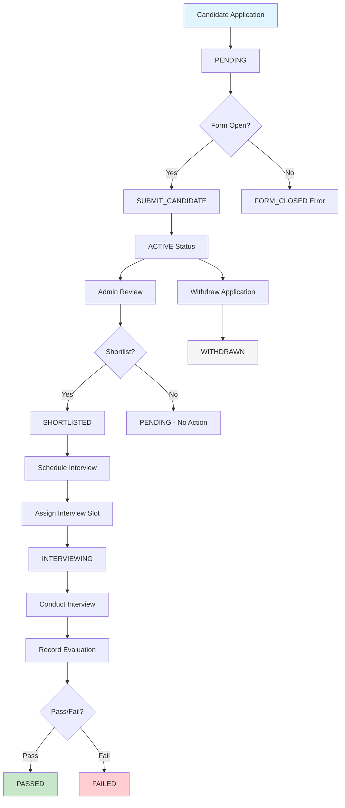

# Interview Process Workflow

## Overview
The CNC Recruit 2026 Backend API manages a comprehensive interview process for candidate selection. This document outlines the complete workflow from candidate application to final selection, including all status transitions, scheduling, and evaluation components.

## Process Flowchart



## Candidate Status Lifecycle

### 1. Application Status
- **ACTIVE**: Candidate has submitted application and can be considered
- **WITHDRAWN**: Candidate has withdrawn their application

### 2. Interview Status
- **PENDING**: Application submitted, awaiting admin review
- **SHORTLISTED**: Selected for interview, awaiting scheduling
- **INTERVIEWING**: Interview scheduled, in progress
- **PASSED**: Successfully passed interview
- **FAILED**: Did not pass interview

## Detailed Process Steps

### Phase 1: Application Submission

#### Step 1: Candidate Registration
1. Candidate logs in via Google OAuth
2. System creates/verifies user account
3. Candidate accesses application form

#### Step 2: Form Validation
```typescript
// Check form availability
const formConfig = await formController.getConfig();
const now = new Date();

if (now < new Date(formConfig.opensAt)) {
  throw new DomainError("FORM_NOT_OPEN", "Form submission period has not started");
}

if (now > new Date(formConfig.closesAt)) {
  throw new DomainError("FORM_CLOSED", "Form submission period has ended");
}

if (!formConfig.allowSubmit) {
  throw new DomainError("FORM_DISABLED", "Form submissions are currently disabled");
}
```

#### Step 3: Data Submission
- Personal information (name, contact details)
- Academic information (Nisit ID, GPA, transcript)
- Profile image upload
- Application questions (why CNC, experience, etc.)
- File validation and S3 upload

#### Step 4: Initial Status Assignment
```typescript
// Create candidate with initial status
const candidate = {
  email: user.email,
  nisitId: data.nisitId,
  // ... other fields
  applicationStatus: "ACTIVE",
  interviewStatus: "PENDING",
  editCount: 0,
  createdAt: new Date(),
  updatedAt: null
};
```

### Phase 2: Admin Review & Shortlisting

#### Step 1: Candidate Listing
Admins can view all candidates with filters:
- By interview status
- By application status
- Search by name/Nisit ID
- Pagination support

#### Step 2: Candidate Evaluation
Admins review:
- Complete application data
- Uploaded transcripts
- Application responses
- Profile information

#### Step 3: Shortlisting Decision
```typescript
// Update candidate to SHORTLISTED
await candidateController.updateInterviewStatus(
  candidateId,
  "SHORTLISTED",
  auditMeta
);

// Audit log entry
await auditLogController.log({
  actor: auditMeta.actor,
  action: "SHORTLIST_CANDIDATE",
  target: { type: "CANDIDATE", id: candidateId },
  ip: auditMeta.ip
});
```

### Phase 3: Interview Scheduling

#### Step 1: Slot Management
Admins create interview slots with:
- Start and end times
- Maximum capacity (minimum 2 candidates)
- Status (VACANT, FULL, CLOSE)

#### Step 2: Slot Assignment
```typescript
// Assign candidate to slot
await interviewSlotController.assignCandidate(
  slotId,
  candidateId,
  auditMeta
);

// Update candidate record
await candidateController.assignInterviewSlot(
  candidateId,
  slotId,
  auditMeta
);

// Update slot status if full
const slot = await interviewSlotController.getById(slotId);
if (slot.bookedCandidateIds.length >= slot.maxCandidates) {
  await interviewSlotController.updateStatus(
    slotId,
    "FULL",
    auditMeta
  );
}
```

#### Step 3: Status Update
Candidate status transitions to `INTERVIEWING` when:
- Assigned to an interview slot
- Slot is confirmed and not closed

### Phase 4: Interview Execution

#### Step 1: Interview Room Assignment
Two types of interview rooms:
- **TECHNICAL**: Technical skills assessment
- **ATTITUDE**: Personality and attitude assessment

```typescript
// Update current interview room
await candidateController.updateCurrentRoom(
  candidateId,
  "TECHNICAL", // or "ATTITUDE"
  auditMeta
);
```

#### Step 2: Question Management
For each interview room, admins can:
- Add predefined questions
- Record candidate answers
- Assign scores (0-10)
- Add reviewer notes

#### Interview Question Structure
```typescript
{
  candidateId: "candidate_id",
  questions: {
    technical: [
      {
        title: "Explain REST API principles",
        answer: "Candidate's response...",
        score: 8
      }
    ],
    attitude: [
      {
        title: "Describe a team conflict you resolved",
        answer: "Candidate's response...",
        score: 9
      }
    ]
  },
  reviewers: [
    {
      name: "Reviewer Name",
      score: 8.5,
      notes: "Strong technical skills, needs improvement in communication",
      room: "TECHNICAL"
    }
  ],
  audios: {
    technical: "s3-key-for-audio.mp3",
    attitude: null
  }
}
```

#### Step 3: Real-time Updates
During interview:
- Questions can be added/updated
- Scores can be adjusted
- Reviewer comments recorded
- Audio recordings uploaded

### Phase 5: Evaluation & Decision

#### Step 1: Score Calculation
```typescript
// Calculate average scores
function calculateScores(interviewQuestions: InterviewQuestion) {
  const technicalScores = interviewQuestions.questions.technical
    .filter(q => q.score !== undefined)
    .map(q => q.score!);
  
  const attitudeScores = interviewQuestions.questions.attitude
    .filter(q => q.score !== undefined)
    .map(q => q.score!);
  
  const reviewerScores = interviewQuestions.reviewers
    .map(r => r.score);
  
  return {
    technicalAverage: technicalScores.length > 0 
      ? technicalScores.reduce((a, b) => a + b) / technicalScores.length 
      : 0,
    attitudeAverage: attitudeScores.length > 0 
      ? attitudeScores.reduce((a, b) => a + b) / attitudeScores.length 
      : 0,
    reviewerAverage: reviewerScores.length > 0 
      ? reviewerScores.reduce((a, b) => a + b) / reviewerScores.length 
      : 0,
    overallAverage: // Weighted average calculation
  };
}
```

#### Step 2: Decision Making
Admins consider:
- Technical scores
- Attitude scores
- Reviewer comments
- Overall impression
- Available positions

#### Step 3: Final Status Update
```typescript
// Update to PASSED
await candidateController.updateInterviewStatus(
  candidateId,
  "PASSED",
  auditMeta
);

// Or update to FAILED
await candidateController.updateInterviewStatus(
  candidateId,
  "FAILED",
  auditMeta
);
```

### Phase 6: Post-Interview Actions

#### Step 1: Slot Cleanup
```typescript
// Remove candidate from slot after interview
await interviewSlotController.removeCandidate(
  slotId,
  candidateId,
  auditMeta
);

// Update slot status
const slot = await interviewSlotController.getById(slotId);
if (slot.bookedCandidateIds.length < slot.maxCandidates) {
  await interviewSlotController.updateStatus(
    slotId,
    "VACANT",
    auditMeta
  );
}
```

#### Step 2: Data Archiving
- Interview questions and scores preserved
- Audio recordings retained
- All data available for future reference

#### Step 3: Reporting
- Generate interview statistics
- Export candidate evaluations
- Create selection reports

## Interview Slot Management

### Slot Creation
```typescript
// Create new interview slot
const slot = {
  startTime: "2024-03-15T10:00:00Z",
  endTime: "2024-03-15T12:00:00Z",
  maxCandidates: 4,
  bookedCandidateIds: [],
  status: "VACANT",
  createdAt: new Date().toISOString(),
  updatedAt: null
};
```

### Slot Status Transitions
```
VACANT → FULL (when bookedCandidateIds.length >= maxCandidates)
FULL → VACANT (when candidate removed)
ANY → CLOSE (admin manually closes slot)
CLOSE → VACANT (admin reopens slot)
```

### Capacity Management
- Minimum 2 candidates per slot
- Automatic status updates
- Conflict prevention
- Waitlist capability (future)

## Time-Based Controls

### 1. Form Schedule
- **opensAt**: When applications open
- **closesAt**: When applications close
- **editableUntil**: Deadline for candidate edits

### 2. Countdown Features
- **countdownTitle**: Display title for countdown
- **countdownTime**: Target time for countdown
- **timeupMessage**: Message when time is up
- **recruitState**: Current recruitment phase (0-3)

### 3. Validation Rules
```typescript
// Check if candidate can edit application
function canEditCandidate(candidate: Candidate, formConfig: Form): boolean {
  const now = new Date();
  const editableUntil = new Date(formConfig.editableUntil);
  
  return (
    candidate.applicationStatus === "ACTIVE" &&
    candidate.interviewStatus === "PENDING" &&
    now <= editableUntil &&
    candidate.editCount < MAX_EDIT_COUNT
  );
}
```

## Withdrawal Process

### Candidate-Initiated Withdrawal
```typescript
// Candidate withdraws application
await candidateWithdrawalService.withdrawCandidate(
  candidateId,
  auditMeta
);

// Updates:
// 1. Candidate status: ACTIVE → WITHDRAWN
// 2. Interview status: Any → WITHDRAWN
// 3. Remove from interview slot if assigned
// 4. Log withdrawal action
```

### Admin-Initiated Withdrawal
Admins can withdraw candidates with:
- Reason for withdrawal
- Audit trail
- Notification to candidate (future)

## Special Cases

### 1. Duplicate Applications
```typescript
// Prevent duplicate Nisit ID
const existingCandidate = await candidatesCol.findOne({
  nisitId: data.nisitId,
  applicationStatus: { $ne: "WITHDRAWN" }
});

if (existingCandidate) {
  throw new DomainError(
    "DUPLICATE_NISIT_ID",
    "A candidate with this Nisit ID already exists"
  );
}
```

### 2. Edit Limitations
- Maximum edit count enforced
- Edit period time-bound
- No edits after shortlisting
- Audit trail of all changes

### 3. Slot Changes
```typescript
// Change candidate to different slot
await interviewSlotController.changeCandidateSlot(
  candidateId,
  currentSlotId,
  newSlotId,
  auditMeta
);
```

## Integration Points

### 1. Audit Logging
Every significant action is logged:
- Status changes
- Slot assignments
- Score updates
- Withdrawals

### 2. File Storage
- Profile images (public)
- Transcripts (private)
- Audio recordings (private)
- All files linked to candidate records

### 3. User Management
- Role-based access control
- Admin permissions
- Candidate self-service
- Authentication integration

## API Endpoints Summary

### Candidate Endpoints
- `POST /candidate` - Submit application
- `GET /candidate/me` - Get own application
- `PATCH /candidate/me` - Update application
- `POST /candidate/me/withdraw` - Withdraw application

### Admin Candidate Management
- `GET /admin/candidates` - List all candidates
- `GET /admin/candidates/:id` - Get candidate details
- `PATCH /admin/candidates/:id` - Update candidate
- `PATCH /admin/candidates/:id/interview-status` - Update interview status
- `PATCH /admin/candidates/:id/current-room` - Update interview room

### Interview Slot Management
- `GET /admin/interview-slot` - List all slots
- `POST /admin/interview-slot` - Create slot
- `POST /admin/candidates/:id/assign-slot` - Assign to slot
- `POST /admin/candidates/:id/change-slot` - Change slot

### Interview Question Management
- `GET /admin/interview-question/:candidateId` - Get questions
- `POST /admin/interview-question/:candidateId/question` - Add question
- `PATCH /admin/interview-question/:candidateId/question/:index` - Update question
- `POST /admin/interview-question/:candidateId/reviewer` - Add reviewer

## Error Handling

### Common Errors
- `FORM_CLOSED`: Application period ended
- `FORM_NOT_OPEN`: Application period not started
- `EDIT_PERIOD_ENDED`: Edit deadline passed
- `SLOT_FULL`: Interview slot at capacity
- `SLOT_CLOSED`: Slot manually closed
- `DUPLICATE_NISIT_ID`: Nisit ID already exists
- `CANDIDATE_WITHDRAWN`: Candidate has withdrawn

### Recovery Procedures
1. **Slot conflicts**: Automatic reassignment
2. **Form closure**: Graceful error messages
3. **Edit limits**: Clear communication to candidates
4. **System errors**: Automatic retry with audit

## Performance Considerations

### 1. Database Optimization
- Indexes on status fields
- Compound indexes for common queries
- Query projection for partial data
- Connection pooling

### 2. File Handling
- Stream-based uploads/downloads
- Async processing for large files
- CDN for public images
- Compression for storage

### 3. API Performance
- Pagination for large result sets
- Caching for frequently accessed data
- Batch operations where possible
- Monitoring and optimization

## Future Enhancements

### 1. Advanced Features
- **Waitlist management**: For full interview slots
- **Automated scheduling**: AI-based slot assignment
- **Real-time notifications**: Email/SMS updates
- **Video interviews**: Integrated video conferencing

### 2. Analytics & Reporting
- **Interview statistics**: Success rates, average scores
- **Candidate analytics**: Demographic analysis
- **Performance metrics**: Interviewer effectiveness
- **Predictive analytics**: Success prediction models

### 3. Integration Capabilities
- **Calendar integration**: Google Calendar, Outlook
- **HR system integration**: Applicant tracking systems
- **Communication tools**: Slack, Teams notifications
- **Payment systems**: For paid interview processes

## Best Practices

### 1. Candidate Experience
- Clear status communication
- Simple application process
- Transparent timeline
- Support for questions/issues

### 2. Admin Efficiency
- Intuitive interface
- Bulk operations
- Quick status updates
- Comprehensive reporting

### 3. Data Integrity
- Regular backups
- Audit trail maintenance
- Data validation
- Security compliance

### 4. System Reliability
- Monitoring and alerts
- Performance optimization
- Scalability planning
- Disaster recovery

## Conclusion

The interview process workflow in the CNC Recruit 2026 Backend API provides a comprehensive, auditable, and efficient system for managing candidate selection. From initial application to final decision, every step is tracked, validated, and optimized for both candidate experience and administrative efficiency.

The system's modular design allows for future enhancements while maintaining data integrity and security throughout the recruitment process.